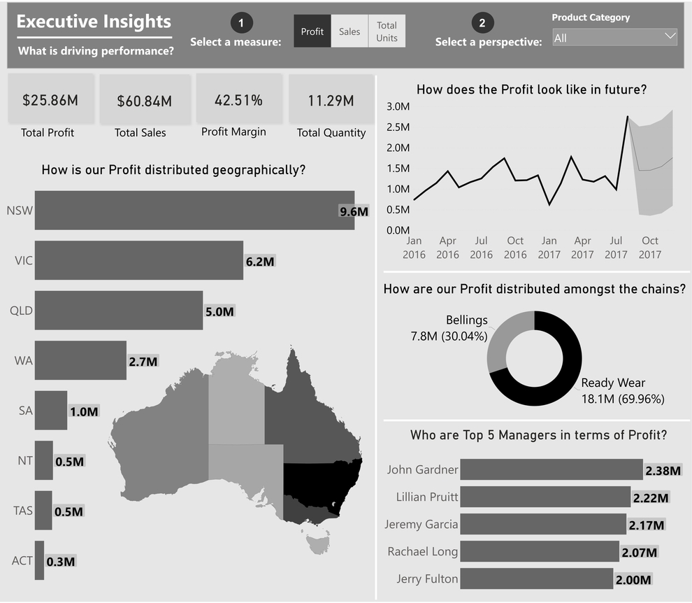

# Australia---Retail-Store-Data-Analysis-using-Power-BI

This report is meant to provide data-driven decision making, while emphasizing user-flexibility and visual analysis. I was able to achieve my goal to empower the user by leveraging dynamic visuals. Thus, this dashboard can scale as the needs of the global business changes.

The focus here is to view the business from multiple angles for these attributes, providing a holistic approach to the business, through dynamic parameters. There were two things I wished to achieve with this dashboard, attractive mapping and next-level user interactivity.

 
 I wanted to have a map that was design oriented and subtle, like an art piece, meant to invite the user into the dashboard. If users are going to be using a report all the time, why not make it pleasing to the eye? I found that design piece with the new “Shape Map” feature, where one can import custom TopoJSON files. I edited and imported a custom world map from http://mapstarter.com/. The simple map was meant to ground the user geographically and compliment the adjacent bar chart, which holds the same information.
 
Overall, with the combination of the custom visuals, and dynamic parameters, I created a clean dashboard for analytical insights that’s also a pleasure to interact with.

**-Deepansh Arora**

